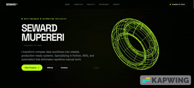

# Seward Mupereri - Portfolio Website

A modern, responsive portfolio website showcasing my projects, skills, and professional experience. Built with a focus on clean design, smooth animations, and optimal user experience.

### Preview



## 🌐 Live Site

Visit the live site: [Portfolio Site Link](https://sewardrichard.github.io/portfolio/)

---

## 📖 Site Overview

### Navigation & Structure

The website consists of the following main sections:

- **Home Page (`index.html`)**
  - **Hero Section**: Introduction with animated text and call-to-action buttons
  - **About Section**: Professional summary and background
  - **Skills Section**: Technical skills organized by category (Data Engineering, Process Automation, Cloud & Full Stack)
  - **Featured Projects**: Interactive coverflow carousel showcasing highlighted work
  - **Contact Section**: Contact form and social links

- **Projects Page (`projects.html`)**
  - Complete list of all projects with filtering capabilities
  - Filter by Tech Stack or Tags using expandable filter sections
  - Project cards with hover effects linking to detailed views

- **Project Detail Page (`project.html`)**
  - Comprehensive project breakdown including:
    - Overview and motivation
    - Development approach
    - Challenges & solutions
    - Outcomes and metrics
    - Tech stack with icons
    - Links to live demos, repositories, and videos

### Key Features

- 🎨 **Dark theme** with lime green accent color
- 📱 **Fully responsive** design for all screen sizes
- ✨ **Smooth animations** and hover effects
- 🔍 **Project filtering** by technology and tags
- 🖼️ **Interactive coverflow** for featured projects
- 📧 **Contact form** integration
- 🎯 **SEO optimized** structure

---

## 🛠️ Tech Stack

| Technology | Purpose |
|------------|---------|
| **HTML5** | Semantic markup and structure |
| **TailwindCSS** | Utility-first CSS framework (via CDN) |
| **JavaScript (ES6+)** | Interactivity and dynamic content |
| **Iconify** | Icon library for tech stack icons |
| **Google Fonts** | Typography (Inter, Space Grotesk) |

### Project Structure

```
portfolio/
├── index.html              # Main landing page
├── projects.html           # All projects listing
├── project.html            # Individual project detail
├── css/
│   └── styles.css          # Custom styles & animations
├── js/
│   ├── main.js             # Core functionality
│   ├── includes.js         # HTML partials loader
│   ├── coverflow.js        # Featured projects carousel
│   ├── mobile-menu.js      # Mobile navigation
│   ├── projects-page.js    # Projects filtering
│   └── project-detail.js   # Project detail rendering
├── partials/               # Reusable HTML components
│   ├── header.html
│   ├── footer.html
│   ├── hero.html
│   ├── about.html
│   ├── skills.html
│   ├── work.html
│   ├── contact.html
│   ├── project/            # Project detail partials
│   └── projects/           # Projects page partials
├── data/
│   └── projects.json       # Project data source
└── images/                 # Image assets
```

---

## 🚀 Getting Started

### Prerequisites

- A modern web browser (Chrome, Firefox, Safari, Edge)
- A local web server (required for loading partials via fetch)
- Git (for cloning the repository)

### Clone the Repository

```bash
git clone https://github.com/sewardmupereri/portfolio.git
cd portfolio
```

### Running Locally

Since the site uses `fetch()` to load HTML partials, you need to serve it via a local web server. Here are several options:

#### Option 1: Python (Recommended)

```bash
# Python 3
python -m http.server 8000

# Python 2
python -m SimpleHTTPServer 8000
```

Then open `http://localhost:8000` in your browser.

#### Option 2: Node.js (using serve)

```bash
# Install serve globally
npm install -g serve

# Run the server
serve .
```

#### Option 3: VS Code Live Server

1. Install the "Live Server" extension in VS Code
2. Right-click on `index.html`
3. Select "Open with Live Server"

#### Option 4: PHP

```bash
php -S localhost:8000
```

---

## 🌍 Deploying to GitHub Pages

### Step 1: Create a GitHub Repository

1. Go to [github.com](https://github.com) and create a new repository
2. Name it `<your-username>.github.io` for a user site, or any name for a project site

### Step 2: Push Your Code

```bash
# Initialize git (if not already done)
git init

# Add all files
git add .

# Commit
git commit -m "Initial commit"

# Add remote origin
git remote add origin https://github.com/<your-username>/<repo-name>.git

# Push to main branch
git push -u origin main
```

### Step 3: Enable GitHub Pages

1. Go to your repository on GitHub
2. Navigate to **Settings** → **Pages**
3. Under "Source", select **Deploy from a branch**
4. Choose the **main** branch and **/ (root)** folder
5. Click **Save**

### Step 4: Access Your Site

Your site will be available at:
- User site: `https://<your-username>.github.io`
- Project site: `https://<your-username>.github.io/<repo-name>`

> **Note:** It may take a few minutes for the site to be published after enabling GitHub Pages.

---

## 📝 Customization

### Updating Projects

Edit `data/projects.json` to add, modify, or remove projects. Each project follows this structure:

```json
{
  "slug": "project-url-slug",
  "title": "Project Title",
  "short_description": "Brief description",
  "featured": true,
  "cover_image": "images/projects/cover.jpg",
  "tech_stack": ["python", "react", "aws"],
  "tags": ["automation", "web-app"],
  "why_built": "Motivation and problem statement",
  "development_approach": ["Step 1", "Step 2"],
  "challenges": [
    {"challenge": "Problem", "solution": "Solution"}
  ],
  "outcomes": ["Outcome 1", "Outcome 2"],
  "metrics": ["Metric 1", "Metric 2"],
  "repo_url": "https://github.com/...",
  "live_url": "https://...",
  "video_url": "https://..."
}
```

### Updating Personal Information

- **Hero Section**: Edit `partials/hero.html`
- **About Section**: Edit `partials/about.html`
- **Skills**: Edit `partials/skills.html`
- **Contact**: Edit `partials/contact.html`

---

## 📄 License

This project is open source and available under the [MIT License](LICENSE).

---

## 📬 Contact

- **Email**: [sewardrichardmupereri@gmail.com](mailto:sewardrichardmupereri@gmail.com)
- **LinkedIn**: [linkedin.com/in/sewardmupereri](https://linkedin.com/in/sewardmupereri)
- **GitHub**: [github.com/sewardmupereri](https://github.com/sewardmupereri)
